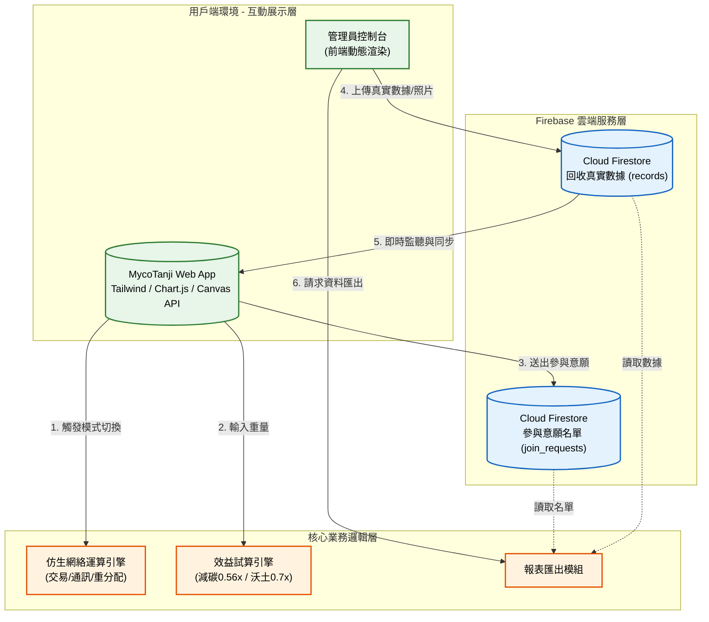

# MycoTanji：仿生社區碳循環系統 🌿

## 1. 專案介紹

### 1.1 系統目的簡介

本系統旨在建立一套模仿自然界「菌根菌網絡（Mycorrhizal Networks）」資源調度邏輯的社區廢棄物管理平台。專注於解決三峽北大特區高密度咖啡商圈與住宅區所產生的「咖啡渣」與「落葉」問題。透過互動式仿生視覺化畫布、即時碳循環監測站與效益試算機，將生硬的廢棄物回收轉化為可見的「減碳量」與「有機沃土（黑金土）」產出。系統整合 Firebase 提供即時真實數據更新，並建立「加入菌絲網絡」的媒合機制，串聯在地商家與社區，達成從廢棄物到社區可食地景的完美封閉循環。

---

## 2. 系統架構與範圍

### 2.1 系統架構圖

本系統採用無伺服器（Serverless）架構設計，前端專注於互動與視覺呈現，後端高度整合 Firebase 即時資料庫，確保數據的高同步性與管理員操作的便利性。



### 2.2 系統範圍

- **展示層**：使用 Tailwind CSS 建立具備科技感與生態元素的響應式介面，使用 HTML5 Canvas API 繪製動態菌絲網絡，並整合 Chart.js 呈現即時減碳折線圖。
- **數據處理層**：基於 Firebase Firestore 監聽機制（`onSnapshot`），實現回收數據、圖片與進度條的即時同步與渲染。
- **邏輯運算層**：包含效益試算公式（咖啡渣/落葉對應的碳排規避與沃土轉化率）、圖表數據聚合邏輯，以及 CSV 本地端格式化匯出。
- **權限與管理**：提供輕量級前端密碼驗證機制切換管理員視圖，並結合 Firestore Security Rules 保護意願名單個資。

### 2.3 交付項目

1. 網頁應用程式：單頁式應用 `index.html`（含內聯 CSS 與 ES6 模組化 JavaScript）。
2. 數據庫架構：Firebase Firestore 安全規則（Security Rules）與集合（Collections）結構定義。
3. 視覺與內容資產：在地實證照片（資收、發酵、黑金土、採收）與 UI 圖標資源。
4. 系統技術文檔：本規格說明書。

---

## 3. 業務功能需求

本節描述系統針對不同角色提供的核心功能。

| 需求編號 | 功能名稱 | 參與者 | 功能描述 | 業務邏輯/備註 |
| --- | --- | --- | --- | --- |
| FR-01 | 仿生網絡互動 | 訪客/居民 | 點擊按鈕切換菌絲網絡的「交易」、「通訊」、「重分配」模式。 | Canvas 畫布動態改變粒子顏色、速度、密度與警示標籤。 |
| FR-02 | 效益試算與分享 | 訪客/居民 | 輸入廢棄物類型與重量，預估減碳量與有機土產出，並支援複製成果分享。 | 減碳量 = 重量 * 0.56；沃土量 = 重量 * 0.7。 |
| FR-03 | 即時監測儀表板 | 訪客/居民 | 檢視社區累積攔截量、減碳量、沃土產出與省下公款，並具備圖表與歷史履歷卡片。 | 透過 Firestore 即時監聽更新，圖表依日期聚合數據；並設有 500kg 第一階段目標進度條。 |
| FR-04 | 參與意願遞交 | 在地商家/市民 | 填寫稱呼、身分與 Email 加入菌絲網絡循環。 | 寫入 `join_requests` 集合，前端顯示成功提示。 |
| FR-05 | 真實數據管理 | 管理員 | 密碼登入後，可上傳回收來源、類型、重量與現場壓縮照片，並可刪除錯誤資料。 | 圖片透過 Canvas 在前端自動壓縮並轉為 Base64 寫入 Firestore `records` 集合。 |
| FR-06 | 報表匯出模組 | 訪客/管理員 | 訪客可匯出「碳循環監測站報表」，管理員可額外匯出「參與意願名單」。 | 前端將 JSON 資料轉換為帶有 BOM 標記的 UTF-8 CSV 檔案觸發下載。 |

---

## 4. 非業務功能需求

### 4.1 安全性要求

- **資料存取控制**：透過 Firestore Security Rules 嚴格控制。`records` 開放公開讀取與寫入以利展示；`join_requests` 僅開放新增（Create）與管理員讀取（Read），嚴禁外部修改與刪除，保護個資。
- **管理員防護**：前端登入機制作為 UI 切換屏障，結合後端資料庫規則雙重管理。

### 4.2 系統效能

- **圖片最佳化**：管理員上傳實景照片時，前端會自動攔截並將圖片等比例壓縮至最大寬度 600px，並轉換為 70% 畫質的 JPEG Base64 格式，大幅降低資料庫儲存壓力與前端載入時間。
- **即時同步**：Firestore 數據異動需在毫秒級別反映於前端 Dashboard 與 Chart.js 圖表。

### 4.3 準確性與可用性

- **無伺服器依賴**：完全依賴前端瀏覽器運算與 Firebase 雲端服務，無須建置與維護傳統伺服器。
- **跨裝置相容**：使用 Tailwind CSS 確保在桌面、平板與手機上皆能完美呈現，互動畫布具備 `resize` 監聽器，自適應容器大小。

---

## 5. 系統數據結構設計

### 5.1 Firestore 資料模型

系統數據存儲於 Firestore 根目錄下的兩個主要集合（Collections）中。

#### 回收真實數據紀錄 (Records)

- Path: `/records/{documentId}`
- 格式:
```json
{
  "date": "2026-04-27",
  "source": "連鎖咖啡品牌 A 北大店",
  "type": "Coffee Grounds",
  "weight": 5.5,
  "desc": "今日下午批次回收",
  "img": "data:image/jpeg;base64,/9j/4AAQSkZJRgABAQAAAQ...",
  "timestamp": 1714220000000
}
```

#### 參與意願名單 (Join Requests)

- Path: `/join_requests/{documentId}`
- 格式:
```json
{
  "name": "王小明",
  "role": "shop",
  "email": "ming@example.com",
  "date": "2026-04-27T12:00:00.000Z",
  "timestamp": 1714220000000
}
```

---

## 6. 專案開發與部署

### 前置需求

- 支持 ES6 模組的現代瀏覽器。
- Firebase 專案（需啟用 Firestore Database）。
- 靜態網頁託管服務（如 GitHub Pages、Vercel 或 Firebase Hosting）。

### 部署步驟

1. **環境初始化**：於 Firebase Console 建立專案，獲取 Firebase Config (API Key, Project ID 等)。
2. **參數配置**：將 Firebase Config 填入 `index.html` 中的 `<script type="module">` 區塊。
3. **安全規則設定**：於 Firestore 後台套用專案指定的 Security Rules，確保意願名單個資安全。
4. **前端佈署**：將 `index.html` 及 `assets` 圖片資料夾上傳至靜態託管空間。
5. **整合測試**：進行手機端版面檢查、管理員數據上傳測試、Canvas 動畫效能測試，以及 CSV 匯出亂碼驗證。
